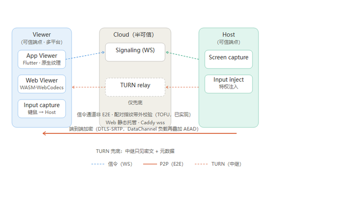
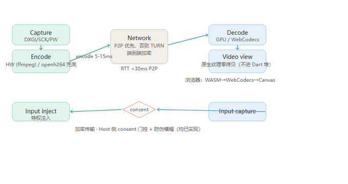
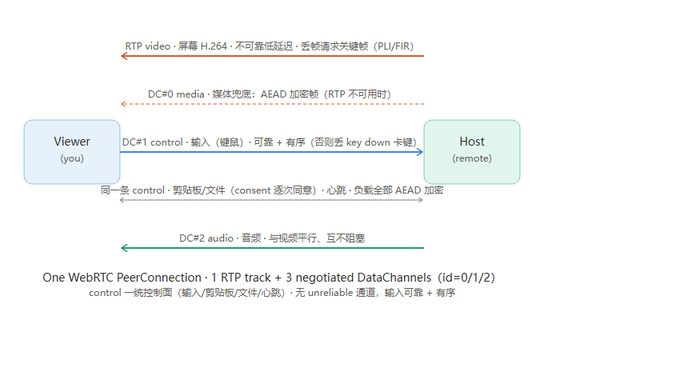
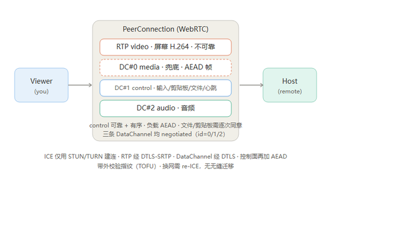

# 远程桌面控制系统 · 架构图说明

本文档与同目录下的 4 张 PNG 架构图配套，描述一套采用 **Rust 核心 + 多平台 Viewer、传输采用 WebRTC** 的远程桌面控制系统架构。Viewer 产品形态包括 **Flutter App**（iOS / Android / Windows 等）与**浏览器 Web Viewer**（静态页 + WASM，复用同一 Rust 核心编译），另有一个无头 `rdcore-viewer-cli` 仅作 CI 链路验证 harness，不是用户产品。

## 1. 网络拓扑（信任边界）
文件：`01_topology_trust.png`

- 两端为**可信端点**（Viewer / Host），中间云为**半可信**（Cloud semi-trusted）。Viewer 为多平台：Flutter App（iOS / Android / Windows 等）与浏览器 Web Viewer，二者与 Host 的握手、通道、加密完全一致；浏览器经 HTTPS 静态页加载（WASM + WebCodecs），信令经 Caddy 以 wss 反代同一 Signaling Service。
- **控制通道**（虚线）走 WebSocket 信令，仅交换 SDP offer/answer 与 ICE candidate，**不承载任何媒体或键鼠数据**，且**非端到端**。首次配对需带外校验 DTLS 密钥指纹（如 safety number 比对或二维码扫描），防止信令服务器 MITM。
- **媒体通道**（橙实线）为端到端加密（DTLS-SRTP）的 P2P，理想情况绕过服务器。
- **TURN 中继**（橙虚线）仅在 P2P 失败时使用，此时中继可见密文与元数据（谁连谁、流量、时序）。生产环境 TURN 自建；使用第三方中继需作为额外信任假设。

## 2. 延迟敏感管线（编码回退 + 原生渲染 + 输入 consent）
文件：`02_pipeline_fallback.png`

- Host 侧：捕获（DXGI / ScreenCaptureKit / PipeWire）→ 编码（硬件 NVENC/QuickSync/AMF/VideoToolbox，**无 GPU 时回退软件 openh264**）。捕获需处理分辨率变更、显示器插拔、DXGI ACCESS_LOST 等异常；捕获层输出 dirty/move-rect 元数据，用于决定何时请求关键帧、以及软件回退时的区域编码（硬件编码器吃整帧或 ROI，不直接编码"变化区域"）。
- 网络：P2P，失败走 TURN，全程 E2E 加密。端到端目标 <150 ms（理想 <100 ms），其中编码 5–15 ms，P2P RTT 尽量 <30 ms。
- Viewer 侧：解码（目标 GPU 硬解，当前实现为 openh264 软解）→ **原生纹理渲染，像素不经 Dart**，避免每帧过 FFI 拷贝；界面显示实时延迟、码率、是否经过 TURN 中继。
  - 实现注记（2026-07 闭环）：并非 PlatformView，而是 Flutter `TextureRegistry` 注册的原生纹理 + `Texture` 控件——Rust 解码帧经原生插件导出的 `rdcore_texture_submit` C 函数直接写入原生缓冲（iOS=`CVPixelBuffer` / Android=CPU Surface），Dart 仅合成纹理 id；消费不及的时候「追帧丢旧」（积压帧解码以维持 H.264 参考链、仅最新帧上屏），纹理不可用（桌面/headless/缺插件）自动回退 `pull_frame` 字节路径。
  - **浏览器分支（Web Viewer）**：同一 Rust 核心编译为 WASM，在 Web Worker 内完成 E2E 解密与 RTP/帧重组；H.264 Annex-B 按 IDR 判 key/delta 帧（delta 之前先等到 IDR 才送解，避免花屏），送 WebCodecs `VideoDecoder` 硬解/软解，解码帧经 `VideoFrame` 绘制到 OffscreenCanvas；键鼠事件反向走同一 control DataChannel。因 WebCodecs 与 WASM 线程要求 secure context（+ COOP/COEP），Web Viewer 必须 HTTPS 部署。
- 输入反向：Viewer 捕获键鼠 → 经加密通道发送 → Host 注入（特权操作）。连接需 Host 用户同意（交互模式）或设备预授权 + 临时 PIN（无人值守模式）；Host 端常驻**不可伪造横幅**，由独立高权限服务或 OS 安全注意序列绘制，Viewer 无法覆盖，可随时终止。

## 3. 传输通道分工
文件：`03_transport_channels.png`

- 一个 WebRTC PeerConnection 复用 **1 路 RTP 视频轨道 + 3 条协商式 DataChannel**（实测 `rdcore-rtc/real.rs`），四类流量 QoS 各异：
  - **媒体（屏幕）**：RTP video track（H.264，不可靠低延迟），Host→Viewer 单向，可丢帧，丢帧即请求关键帧（PLI/FIR）。
  - **DataChannel `media`（id=0，媒体兜底）**：RTP 不可用时的备用媒体路径，帧经 E2E 会话密钥 AEAD 加密后发出（`Message::Encrypted`）。
  - **DataChannel `control`（id=1，控制面总线，可靠 + 有序）**：输入（Viewer→Host）、剪贴板、文件传输、心跳、consent 全部复用这一条；应用层负载统一 AEAD 加密（`AppMessage`，或裸 `Message::FileTransfer` / `Message::Clipboard` → `Message::Encrypted`），云端只见密文。文件/剪贴板需 Host 逐次同意（未同意前 Chunk 按协议违规拒收）。输入必须可靠 + 有序，否则丢 `key down` 会卡键。
  - **DataChannel `audio`（id=2，音频）**：与视频平行、互不阻塞。
  - 实现注记（2026-07-24 实测）：三条 DataChannel 均为 `ordered: true`（可靠 + 有序），**没有** unreliable / unordered 通道——早期稿中"鼠标移动走 unreliable + unordered、latest-state 丢包无碍"是未兑现的设计目标；如需降低鼠标带宽，应在应用层做坐标合并，或另行新增一条 unreliable 通道。
- **Web 端复用同一通道规划**：浏览器原生 `RTCPeerConnection` 与 Rust（webrtc-rs）互通，同样协商 `media`/`control`/`audio` 三条 DataChannel（id=0/1/2），协议消息与 E2E AEAD 完全一致，Host 无需感知对端是 App 还是浏览器。

## 4. WebRTC PeerConnection 内部结构
文件：`04_webrtc_pc.png`

- 所有通道装进一个 WebRTC PeerConnection（实测 `rdcore-rtc/real.rs` 通道创建）：
  - 1 路 **RTP video**（屏幕，H.264，不可靠低延迟）
  - **DataChannel `media`（id=0）**：媒体兜底（AEAD 加密帧）
  - **DataChannel `control`（id=1）**：输入 / 剪贴板 / 文件 / 心跳 / consent（可靠 + 有序；文件·剪贴板需 Host 逐次同意）
  - **DataChannel `audio`（id=2）**：音频
- ICE 仅用 STUN/TURN 建立连接；RTP 视频经 DTLS-SRTP 加密，DataChannel 经 DTLS 加密；控制面应用负载再叠加一层 E2E 会话密钥 AEAD（信令与云只见密文）。
- 会话状态机：Idle → Signaling → Connecting → Connected → Reconnecting；换网或断线后自动重协商，必要时回到 Signaling 重新交换 SDP。
  - 实现注记：重连由 `ConnectionSupervisor` 驱动——心跳判死（Dead）→ 线性退避 → `conn.reconnect()`；重连复用持久化身份（TOFU）+ session_id 重新签名鉴权，不消耗配对 token。
- 代价：换网无无缝迁移（需 re-ICE）；原生 ICE/STUN/TURN 仍需自建/托管。

## 5. 云端控制平面（服务划分与信任角色）

本系统的云只承担**控制平面**：负责身份、会话建立与权限等元数据，**不处理屏幕或键鼠数据**——数据平面走 WebRTC P2P，绕过云。

控制平面划分为：

- **API Gateway**：统一入口，负责路由、限流与 TLS 终结。
- **Authentication Service**：用户认证与 Token 签发（MFA 为规划项，当前未实现）。
- **Device Registry**：保存 `device_id` / `owner_id` / `public_key` / `status` / `last_online` / `permissions`，**不保存屏幕与键鼠数据**。
- **Signaling Service**：仅做会话建立与 SDP/ICE 交换，**不参与视频转发、不碰控制数据**（即 §1 的"控制通道"）。
- **Permission Service**：控制 / 文件 / 剪贴板权限与时间策略。
- **Audit Service**：记录登录、连接开始、授权、文件传输、会话结束等事件，用于事后审计。
- **Web 静态托管（Web Viewer 交付）**：浏览器 Viewer 为纯静态构建产物（HTML/JS/WASM），由 Caddy 托管；同一 Caddy 反代 `/signaling/`（前缀剥离 → Signaling Service :8080，wss）并附加 COOP/COEP 头（WASM 线程所需），TLS 用 Let's Encrypt IP 证书（shortlived profile + `default_sni`，支持直接以 IP 访问）。静态托管只下发代码，不参与任何会话数据。

信任角色：

- 控制平面为**半可信**：可掌握"谁连谁、何时连、带宽多少"等元数据，但拿不到端到端加密的屏幕内容。
- **TURN 中继**属于数据平面的兜底（见 §1），会看到密文与元数据；因其可见流量特征，TURN 自建而非依赖第三方。

## 关键设计决策
- **Viewer 多平台**：Flutter App（iOS / Android / Windows 等）与浏览器 Web Viewer 并存，共用同一 Rust 核心（Web 端编译为 WASM）与同一协议栈；Host 不区分对端形态。另有 `rdcore-viewer-cli` 无头 harness（自带信令 + Host，回环跑通握手与加密往返），仅用于 CI 验证，非用户产品。
- **传输**：WebRTC（1 路 RTP 视频轨道 + media/control/audio 三条协商式 DataChannel；控制面负载叠加 E2E AEAD）。
- **编码**：硬件优先，软件回退；默认 H.264，H.265 仅双端支持时启用。
- **安全**：E2E（DTLS-SRTP / DTLS）+ 带外指纹校验；输入注入特权模型 + 不可伪造横幅（独立高权限服务/OS 安全注意序列绘制）+ 随时终止。
- **设备身份**：每台设备首次安装生成密钥对并导出身份证书；首连向两端展示 SHA256 指纹，用户通过带外（电话/IM/扫码）核对；核对通过后记为可信设备，后续自动验证，防止信令劫持、MITM 与设备冒充。
- **渲染**：原生纹理，像素不过 Dart。
- **范围**：当前方案覆盖单屏视频、音频（`rdcore-audio` + audio DataChannel）、键鼠输入、文件/剪贴板传输；剪贴板与文件默认 opt-in。多显示器拓扑、分辨率/DPI 协商等需独立模块另行设计。
- **访问模式**：交互模式（Host 用户点接受）+ 无人值守模式（设备绑定 + 临时 PIN）两种都要支持。设备绑定通过首次配对码/二维码交换设备证书，后续用临时 PIN 建立会话。
- **Host 加固**：网络 / 解码面跑低权限沙箱进程，捕获设好后 drop 权限，降低解析不可信包导致的 RCE 风险。
